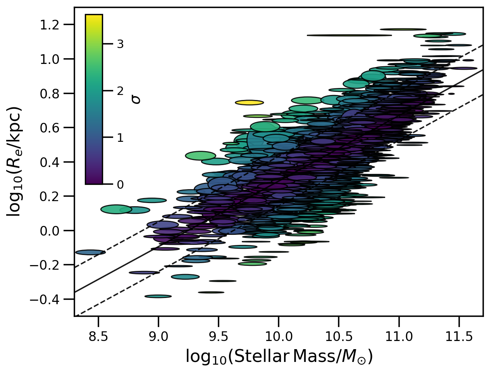

################################################
GAMA size-mass relation from Lange et. al., 2015
################################################

Run the fit and plot

.. code-block:: python

    from hyperfit.linfit import LinFit
    from hyperfit.data import GAMAsmVsize

    # Load the data
    data = GAMAsmVsize()
    hf = LinFit(data.xs, data.cov, weights=data.weights)

    # Run an MCMC
    bounds = ((-10.0, 10.0), (-1000.0, 1000.0), (1.0e-5, 500.0))
    mcmc_samples, mcmc_lnlike = hf.emcee(bounds, verbose=True)
    print(np.mean(mcmc_samples, axis=1), np.std(mcmc_samples, axis=1))

    # Make the plot
    data.plot(linfit=hf)

Returns

.. math::

    \mathrm{log}_{10}R_{e} \sim \mathcal{N}[\mu=(-0.382 \pm 0.006)\,\mathrm{log_{10}}\mathcal{M}_{*} - (3.53 \pm 0.06)\, , \,\sigma=0.145 \pm 0.003]

