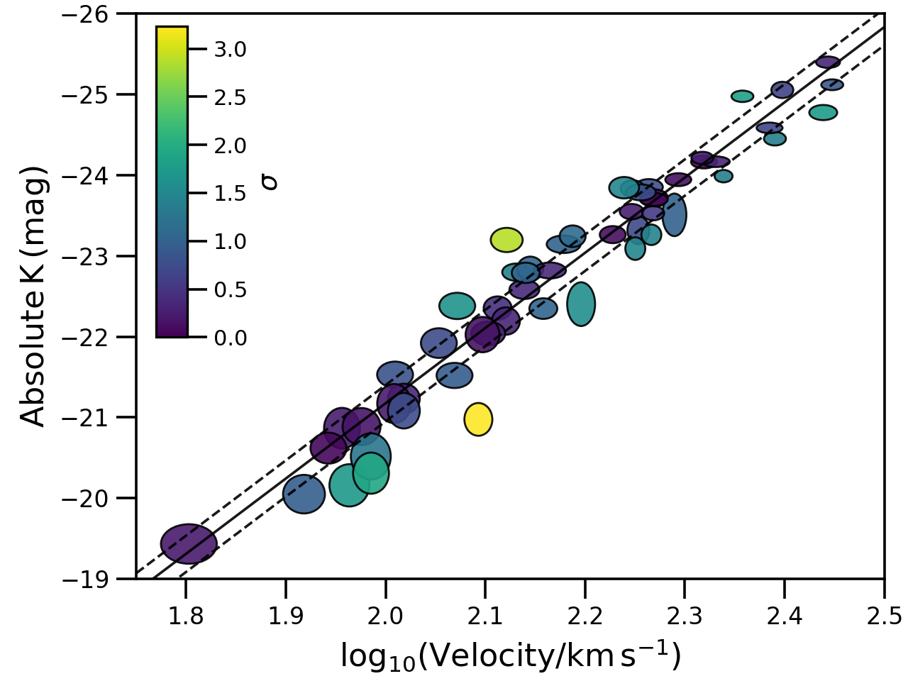

##################################################
Tully-Fisher relation from Obreschkow & Meyer 2013
##################################################

Run the fit and plot

.. code-block:: python

    from hyperfit.linfit import LinFit
    from hyperfit.data import TFR

    # Load the data
    data = TFR()
    hf = LinFit(data.xs, data.cov, weights=data.weights)

    # Run an MCMC
    bounds = ((-10.0, 10.0), (-1000.0, 1000.0), (1.0e-5, 500.0))
    mcmc_samples, mcmc_lnlike = hf.emcee(bounds, verbose=True)
    print(np.mean(mcmc_samples, axis=1), np.std(mcmc_samples, axis=1))

    # Make the plot
    data.plot(linfit=hf)

Returns

.. math::

    M_{K} \sim \mathcal{N}[\mu=(-9.2 \pm 0.4)\,\mathrm{log_{10}}V - (2.8 \pm 0.9)\, , \,\sigma=0.23 \pm 0.04]

