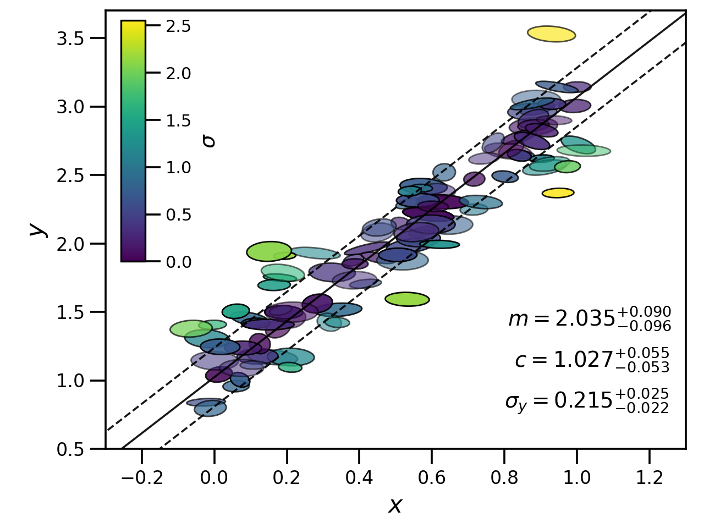

HyperFit
========

HyperFit is a simple python package designed to do one thing:
fit N dimensional data with (possibly covariant) errors with an N-1 dimensional plane, and fit it fast.

Put simply, if you have data with x and y errors and you want the correct method for fitting
a straight line, use this package! But it also works for higher dimensions such as 3D planes and even hyperplanes.

Here is a short example of it in action, which is covered in more detail in the :ref:`tutorial`

.. code-block:: python

    import numpy as np
    from hyperfit.linfit import LinFit
    from hyperfit.data import ExampleData

    data = ExampleData()
    hf = LinFit(data.xs, data.cov, weights=data.weights)

    bounds = ((-5.0, 5.0), (-10.0, 10.0), (1.0e-5, 5.0))
    mcmc_samples, mcmc_lnlike = hf.emcee(bounds, verbose=False)
    sigmas = hf.get_sigmas()

which with some additional plotting code, would allow you to produce a figure like below. Some real astrophysical samples
are given in :ref:`examples-index`.

Contents
--------

.. toctree::
   :maxdepth: 3

   tutorial
   examples/index
   API

Installation
------------

HyperFit requires the following dependencies::

    numpy
    scipy
    pandas
    zeus-mcmc
    emcee

HyperFit can be installed via::

    pip install hyperfit

Citing
------

If you use this package please cite::

    @ARTICLE{2015PASA...32...33R,
           author = {{Robotham}, A.~S.~G. and {Obreschkow}, D.},
            title = "{Hyper-Fit: Fitting Linear Models to Multidimensional Data with Multivariate Gaussian Uncertainties}",
          journal = {\pasa},
         keywords = {fitting, statistics, Astrophysics - Instrumentation and Methods for Astrophysics},
             year = 2015,
            month = sep,
           volume = {32},
              eid = {e033},
            pages = {e033},
              doi = {10.1017/pasa.2015.33},
    archivePrefix = {arXiv},
           eprint = {1508.02145},
     primaryClass = {astro-ph.IM},
           adsurl = {https://ui.adsabs.harvard.edu/abs/2015PASA...32...33R},
          adsnote = {Provided by the SAO/NASA Astrophysics Data System}
    }

and include a link to the `Github <https://github.com/CullanHowlett/HyperFit>`_ repository for this package (so that in the event any errors are identified, we can
blame it on the python or R packages respectively!). This is also the place to highlight bugs or suggest feature requests.

Indices and tables
==================

* :ref:`genindex`
* :ref:`modindex`
* :ref:`search`
