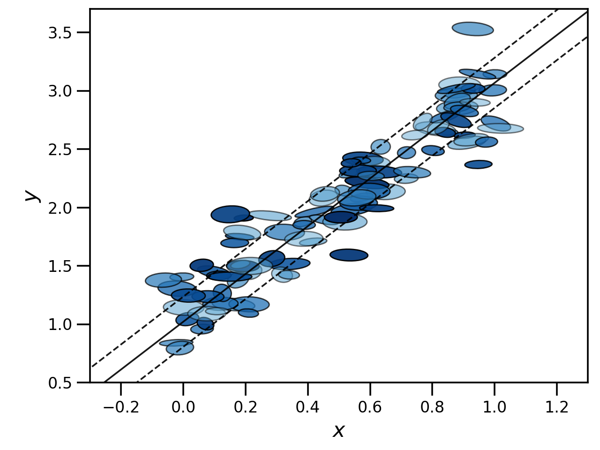
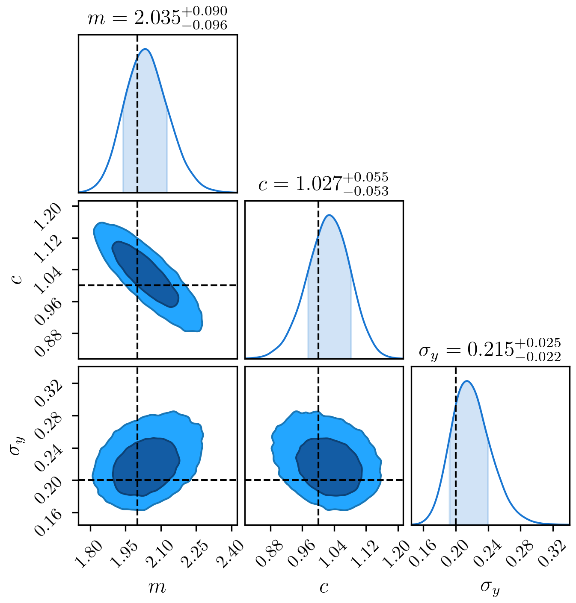
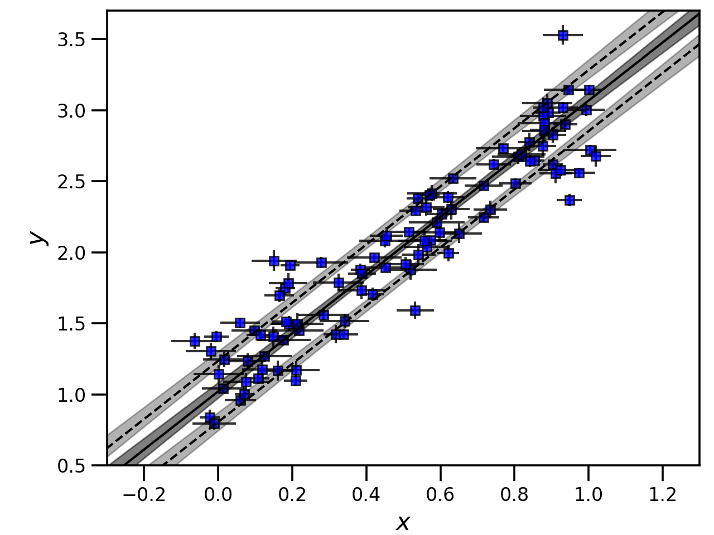
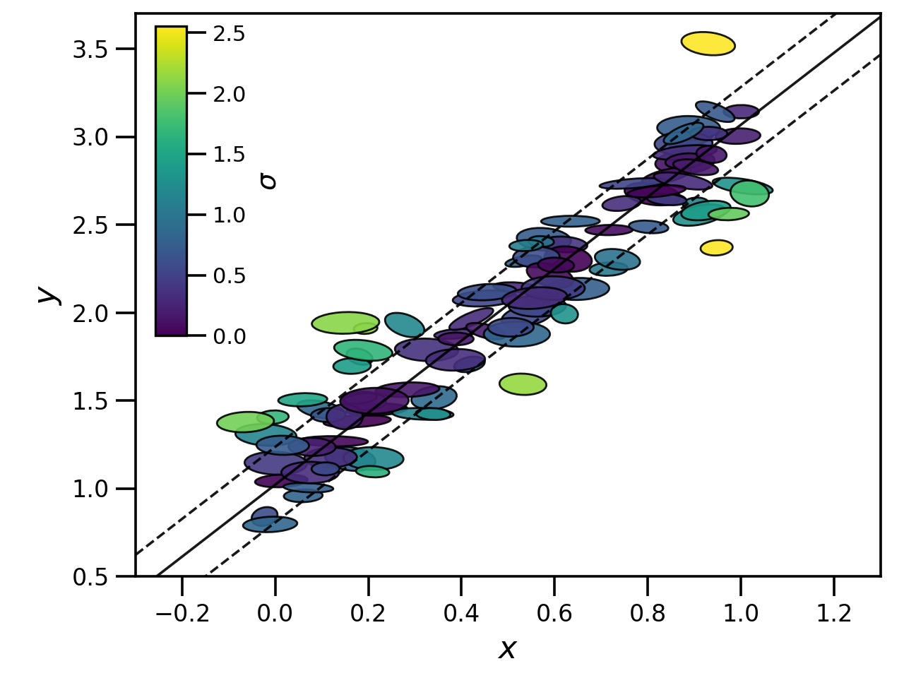

.. _tutorial:

########
Tutorial
########

The **HyperFit** method is fully described in `Robotham & Obreschkow 2015 <https://ui.adsabs.harvard.edu/abs/2015PASA...32...33R/abstract>`_.
This page just gives some basic ideas behind the theory, and details of how this is implemented in Python.

**********
The Theory
**********

As detailed in the above link, we assume that our data is drawn from an N-1 dimensional hyperplane :math:`\mathcal{H}`, with some intrinsic, Gaussian scatter
orthogonal to this plane :math:`\sigma_{\perp}`. We can always define a normal vector :math:`\boldsymbol{n}` that goes from the origin to this plane.

If we then have a bunch of :math:`N` measurements at locations :math:`\boldsymbol{x_{i}}`, each with it's own covariance matrix :math:`\mathsf{\boldsymbol{C_{i}}}`,
we can write the log likelihood of our data in terms of the vector :math:`\boldsymbol{n}` as

.. math::

    \mathrm{ln}\mathcal{L} = \frac{1}{2}\sum_{i=1}^{N}\biggl[\mathrm{ln}\biggl(\sigma_{\perp} + \frac{\boldsymbol{n}^{T}\mathsf{\boldsymbol{C_{i}}}\boldsymbol{n}}{\boldsymbol{n}^{T}\boldsymbol{n}}\biggl) + \frac{(\boldsymbol{n}^{T}[\boldsymbol{x_{i}}-\boldsymbol{n}])^{2}}{\sigma^{2}_{\perp}\boldsymbol{n}^{T}\boldsymbol{n} + \boldsymbol{n}^{T}\mathsf{\boldsymbol{C_{i}}}\boldsymbol{n}}\biggl]

**HyperFit** finds the best-fitting plane for the data by maximising this log-likelihood as a function of the components of the normal vector and the
intrinsic scatter. The same log-likelihood can be used to perform an MCMC over these same quantities.

However, for most intents and purposes, having the coordinates of the best-fitting plane in terms of the normal vector and orthogonal scatter is not that
useful. What we can do is write our equation for the plane in Cartesian coordinates as :math:`\boldsymbol{m}^{T}\boldsymbol{x} + c = 0`, with some scatter
in the `vertical` D direction :math:`\sigma_{D}` (where `vertical` can be whichever coordinate axis we choose). I.e., if we are dealing with a simple
2D straight line, then :math:`\boldsymbol{x_{i}}=[x_{i},y_{i}]` and :math:`\boldsymbol{m}=[m,-1]`. Given this description, we can convert our normal vectors to
Cartesian coordinates using

.. math::

    \boldsymbol{m} = -\boldsymbol{n}/n_{D}

    c = \boldsymbol{n}^{T}\boldsymbol{n}/n_{D}

    \sigma_{D} = \sigma_{\perp}(\boldsymbol{n}^{T}\boldsymbol{n})^{1/2}/n_{D}

**HyperFit** performs the necessary conversions between normal and Cartesian coordinates. Fitting ranges, best-fit parameters and MCMC chains
are all returned in Cartesian coordinates, so you don't need to worry about the coordinate transforms. However, if you do need to know the
normal vectors or scatter in the orthogonal axis, these can be still accessed or computed through the class attributes or methods.
See the :\ref:`API` for more details.

**********
The Method
**********

The python package has a single main class :class:`LinFit`. Optimization of the above likelihood is done using
`SciPy's differential evolution <https://docs.scipy.org/doc/scipy/reference/generated/scipy.optimize.differential_evolution.html>`_
algorithm, which is gradient free, fast and quite robust as long as the global minimum is within the user-provided bounds.
Bounds are passed in in Cartesian coordinates; **HyperFit** then works out the corresponding maximum and minimum bounds within this
space for the normal vector and for the orthogonal scatter. Fitting is then performed in terms of the normal vector, before the
reverse coordinate transform is applied and the result returned to the user.

LinFit also contains two different MCMC methods, the excellent `emcee <https://emcee.readthedocs.io/en/stable/>`_ and
`zeus <https://zeus-mcmc.readthedocs.io/en/latest/>`_ samplers. Although quite different in how they work, these are both very robust
and the choice is yours which one you use. In either case, the various functions in **HyperFit** have been vectorised and both
algorithms have automated convergence checks, which means that you can usually get a fully converged set of samples in less than
a couple of minutes!

So, let's have a quick look at a toy example. Some astrophysical examples can be found in the :ref:`examples-index` page.

A simple best-fit
=================

Let's start by generating some noisy 2D data with variable errors and correlation coefficients.
Our true relationship is given by :math:`y = 2x + 1` with an intrinsic Gaussian scatter in the y-direction of 0.2.

.. code-block:: python

    import numpy as np

    # Some true x and y-values with intrinsic scatter
    ndata = 100
    x_true = np.random.rand(ndata)
    y_true = np.random.normal(2.0 * x_true + 1.0, 0.2)

    # Some correlated measurements of the x and y values with different errors and correlation coefficients
    x_err, y_err, corr_xy = (
        0.05 * np.random.rand(ndata) + 0.025,
        0.05 * np.random.rand(ndata) + 0.025,
        2.0 * (np.random.rand(ndata) - 0.5),
    )
    data, cov = np.empty((2, ndata)), np.empty((2, 2, ndata))
    for i, (x, y, ex, ey, rho_xy) in enumerate(zip(x_true, y_true, x_err, y_err, corr_xy)):
        cov[:, :, i] = np.array([[ex ** 2, ex * ey * rho_xy], [ex * ey * rho_xy, ey ** 2]])
        data[:, i] = np.random.multivariate_normal([x, y], cov[:, :, i])

    # Some weights between 0.5 and 1.0
    weights = 0.5 * np.random.rand(ndata) + 0.5

The resulting data looks something like below, where the ellipse encapsulates the :math:`1\sigma` error bounds for each
data point and colour/opacity represents weight - bluer, more opaque points have weights closer to one.
Our input true relationship is given by the solid line, with the intrinsic scatter covered by the two dashed lines.

If we want to find the best fit relationship for our data we can do this by first creating a :class:`LinFit` object
and passing it our data, then calling the ``optimize`` function with some suitable bounds:

.. code-block:: python

    from hyperfit import LinFit

    hf = LinFit(data, cov, weights=weights)

    bounds = ((-5.0, 5.0), (-10.0, 10.0), (1.0e-5, 5.0))
    print(hf.optimize(bounds, verbose=False))

which takes just a couple of seconds for this data on my laptop and returns

.. code-block:: python

    (array([2.04612946, 1.02127379]), 0.21484373891291883, 129.95351565376387)

The first argument in the return tuple is an array containing the best fit parameters of the plane - the constant term :math:`c`
is always given last. The second argument is the intrinsic scatter in the vertical direction. As we did not specify
a vertical axis this was set to the default, the last coordinate axis of the data vector, in this case :math:`y`.
The third return argument is the log-likelihood at the best-fit.

It is important that the bounds given as input to the ``optimize`` function encapsulate the best-fit. The differential-evolution
algorithm is pretty good at identifying the global minimum, but only searches within the bounds provided.

An MCMC
=======

Comparing the results from our fit to the input parameters, we can see that **HyperFit** has recovered these quite well. In order to
determine how well, we can obtain error estimates our the best-fit parameters by running a full MCMC chain

.. code-block:: python

    # Using emcee
    mcmc_samples, mcmc_lnlike = hf.emcee(bounds, verbose=False)

    # Or using zeus
    mcmc_samples, mcmc_lnlike = hf.zeus(bounds, verbose=False)

Which, for this data, takes me about 5-10 and 10-20 seconds to finish on my laptop for ``emcee`` and ``zeus`` respectively.
The results of the two are consistent. Both the ``emcee`` and ``zeus`` calls automatically check for convergence, stopping when
some reasonable defaults are reached, and return chains with the burn-in removed. The default convergence criterion and
burn-in can be modified with optional keyword arguments.

In both cases the bounds are used to set the range of the flat priors, a call to optimize is used to obtain the starting points
and the code returns a list of samples and the corresponding log-likelihood. The last two columns in mcmc_samples are the
constant intercept :math:`c`, followed by the vertical intrinsic scatter.

We can take the mean and standard deviation of these as our quoted results, and we'll see that we recover the input
parameters within one standard deviation

.. code-block:: python

    print(np.mean(mcmc_samples, axis=1), np.std(mcmc_samples, axis=1))
    [2.04246704 1.02406434 0.2199428 ] [0.09377653 0.05470191 0.02383074]

Or we can do something more sophisticated, and plot contours from our samples (I'd recommend the excellent `ChainConsumer <https://samreay.github.io/ChainConsumer/>`_ package):

.. code-block:: python

    from chainconsumer import ChainConsumer

    c = ChainConsumer()
    c.add_chain(mcmc_samples.T, parameters=[r"$m$", r"$c$", r"$\sigma_{y}$"])
    c.plotter.plot(truth=[2.0, 1.0, 0.2], display=True)

Note that because a call to ``emcee`` or ``zeus`` also calls ``optimize``, we also have access to the best-fit point via
``LinFit.coords`` and ``LinFit.vert_scat``. Using these and a bit of plotting know-how, we can make a plot demonstrating
the best-fit and 68% confidence interval for the line plus intrinsic scatter.

.. code-block:: python

    import matplotlib.pyplot as plt

    xvals = np.linspace(-1.0, 1.5, 1000)
    y_bestfit = np.outer(xvals, hf.coords[0]) + hf.coords[1]
    y_chain = np.outer(xvals, mcmc_samples[0]) + mcmc_samples[1]
    y_upper = np.outer(xvals, mcmc_samples[0]) + mcmc_samples[1] + mcmc_samples[2]
    y_lower = np.outer(xvals, mcmc_samples[0]) + mcmc_samples[1] - mcmc_samples[2]
    y_chain_quantiles = np.quantile(y_chain, [0.1587, 0.8414], axis=1)
    y_upper_quantiles = np.quantile(y_upper, [0.1587, 0.8414], axis=1)
    y_lower_quantiles = np.quantile(y_lower, [0.1587, 0.8414], axis=1)

    fig = plt.figure()
    ax = fig.add_axes([0.15, 0.13, 0.83, 0.85])
    ax.errorbar(data[0], data[1], xerr=x_err, yerr=y_err, c="k", mfc="b", marker="s", ls="None", alpha=0.8)
    ax.fill_between(xvals, y_chain_quantiles[0], y_chain_quantiles[1], color="k", alpha=0.5)
    ax.fill_between(xvals, y_upper_quantiles[0], y_upper_quantiles[1], color="k", alpha=0.3)
    ax.fill_between(xvals, y_lower_quantiles[0], y_lower_quantiles[1], color="k", alpha=0.3)
    ax.plot(xvals, y_bestfit, ls="-", c="k")
    ax.plot(xvals, y_bestfit + hf.vert_scat, ls="--", c="k")
    ax.plot(xvals, y_bestfit - hf.vert_scat, ls="--", c="k")
    ax.set_xlabel(r"$x$", fontsize=16)
    ax.set_ylabel(r"$y$", fontsize=16)
    ax.set_xlim(-0.3, 1.3)
    ax.set_ylim(0.5, 3.7)
    plt.show()

A note on normal coordinates
============================

In some cases, you may also want to know the best-fitting parameters in the normal coordinates and the scatter normal to the plane.
You can access these after a call to ``optimize`` using

.. code-block:: python

    print(hf.normal, hf.norm_scat)
    [-0.39307045  0.19545521] 0.03974178631730934

You might also want to know these for each of the points in your MCMC chain and then compute the mean and standard deviation as above.
You can do this using the ``compute_normal`` function.

.. code-block:: python

    normal_mcmc_samples = np.vstack(hf.compute_normal(coords=mcmc_samples[:-1], vert_scat=mcmc_samples[-1]))
    print(np.mean(normal_mcmc_samples, axis=1), np.std(normal_mcmc_samples, axis=1))
    [-0.40639308  0.2003893   0.09683359] [0.03135972 0.02406839 0.00999385]

Sigma offsets
=============

Sometimes, we want to know how far each measurement is away from a line or plane given both the measurement error and
intrinsic scatter. **HyperFit** includes a convenient function for this, ``LinFit.get_sigmas()``, which returns the distance between the
plane and data points in units of the standard deviation. This requires the normal coordinates and normal scatter. You can pass these
in as arrays (i.e., to get the sigma offset for every data point for every sample in an MCMC chain).

.. code-block:: python

    print(hf.get_sigmas(normal=normal_mcmc_samples[:-1], norm_scat=normal_mcmc_samples[-1]))
    [[0.60939063 0.84149233 0.78724786 ... 0.69551866 0.97657028 0.59229374]
     [0.10950662 0.07240107 0.0327657  ... 0.12048005 0.18407655 0.1421682 ]
     [0.04214844 0.13292766 0.08509194 ... 0.03604142 0.23460111 0.05434102]
     ...
     [0.42869884 0.68224901 0.63618007 ... 0.48224236 0.83776708 0.37758293]
     [0.78976172 0.58107896 0.58858145 ... 0.91624085 0.43015999 0.91603182]
     [1.38372406 1.64802965 1.56014184 ... 1.64449213 1.78225778 1.44113633]]

The result is an 2D array, N_data x N_samples in size.

A more likely scenario is you only want to do this for the best fit. Following a call to ``optimize`` or either of the MCMC routines,
the best-fit normal is already stored, so you can just call ``get_sigmas()`` with no arguments.
It is hence simple to remake the first plot on this page with data colour coded by offset from the best-fitting plane.

.. code-block:: python

    sigmas = hf.get_sigmas()

    xvals = np.linspace(-1.0, 1.5, 1000)
    yvals = hf.coords[0] * xvals + hf.coords[1]

    # Generate ellipses
    ells = [
        Ellipse(
            xy=[data[0][i], data[1][i]],
            width=x_err[i],
            height=y_err[i],
            angle=np.rad2deg(np.arccos(corr_xy[i])),
        )
        for i in range(len(data[0]))
    ]

    # Make the plot
    fig = plt.figure()
    ax = fig.add_axes([0.15, 0.15, 1.03, 0.83])
    for i, e in enumerate(ells):
        ax.add_artist(e)
        e.set_color(cm.viridis(sigmas[i] / np.amax(sigmas)))
        e.set_edgecolor("k")
        e.set_alpha(0.9)
    ax.plot(xvals, yvals, c="k", marker="None", ls="-", lw=1.3, alpha=0.9)
    ax.plot(xvals, yvals - hf.vert_scat, c="k", marker="None", ls="--", lw=1.3, alpha=0.9)
    ax.plot(xvals, yvals + hf.vert_scat, c="k", marker="None", ls="--", lw=1.3, alpha=0.9)
    ax.set_xlabel(r"$x$", fontsize=16)
    ax.set_ylabel(r"$y$", fontsize=16)
    ax.set_xlim(-0.3, 1.3)
    ax.set_ylim(0.5, 3.5)

    # Add the colourbar
    cb = fig.colorbar(
        cm.ScalarMappable(norm=colors.Normalize(vmin=0.0, vmax=np.amax(sigmas)), cmap=cm.viridis),
        ax=ax,
        shrink=0.55,
        aspect=10,
        anchor=(-7.1, 0.95),
    )
    cb.set_label(label=r"$\sigma$", fontsize=14)

